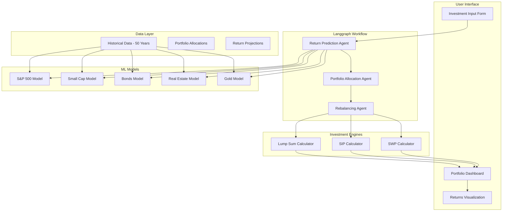

# Design Document

## Overview

This design focuses on the 7 mandatory core components for the Financial Returns Optimizer. The system uses ML models for asset return prediction, LLM agents coordinated through Langgraph, and provides a complete end-to-end investment planning workflow.

## Architecture

### Core System Architecture



## Components and Interfaces

### 1. ML Asset Return Models

```python
class AssetReturnModels:
    def train_sp500_model(self, historical_data: pd.DataFrame) -> MLModel
    def train_small_cap_model(self, historical_data: pd.DataFrame) -> MLModel
    def train_bonds_model(self, historical_data: pd.DataFrame) -> MLModel
    def train_real_estate_model(self, historical_data: pd.DataFrame) -> MLModel
    def train_gold_model(self, historical_data: pd.DataFrame) -> MLModel
    def predict_returns(self, asset_class: str, horizon: int) -> float
```

### 2. Langgraph Agent Workflow

```python
class LanggraphWorkflow:
    def create_return_prediction_agent(self) -> Agent
    def create_portfolio_allocation_agent(self) -> Agent
    def create_rebalancing_agent(self) -> Agent
    def execute_workflow(self, user_input: UserInput) -> PortfolioRecommendation
```

### 3. Portfolio Allocation Engine

```python
class PortfolioAllocationEngine:
    def get_low_risk_allocation(self) -> Dict[str, float]
    def get_moderate_risk_allocation(self) -> Dict[str, float]
    def get_high_risk_allocation(self) -> Dict[str, float]
    def validate_allocation(self, allocation: Dict[str, float]) -> bool
```

### 4. Investment Strategy Calculators

```python
class InvestmentCalculators:
    def calculate_lump_sum(self, amount: float, returns: Dict, years: int) -> List[float]
    def calculate_sip(self, monthly_amount: float, returns: Dict, years: int) -> List[float]
    def calculate_swp(self, initial_amount: float, withdrawal: float, returns: Dict) -> List[float]
```

## Data Models

### User Input Model

```python
class UserInput(BaseModel):
    investment_amount: float
    investment_tenure: int
    risk_profile: Literal["low", "moderate", "high"]
    investment_type: Literal["lump_sum", "sip", "swp"]
    monthly_amount: Optional[float] = None
    withdrawal_amount: Optional[float] = None
```

### Portfolio Allocation Model

```python
class PortfolioAllocation(BaseModel):
    sp500: float
    small_cap: float
    t_bills: float
    t_bonds: float
    corporate_bonds: float
    real_estate: float
    gold: float
    
    @validator('*')
    def validate_percentage(cls, v):
        return max(0, min(100, v))
```

### Investment Projection Model

```python
class InvestmentProjection(BaseModel):
    years: List[int]
    portfolio_values: List[float]
    annual_returns: List[float]
    cumulative_returns: List[float]
    allocation_changes: Optional[List[Dict[str, float]]] = None
```

## Error Handling

### ML Model Errors
- **Training Failure:** When insufficient historical data for model training
- **Prediction Error:** When model fails to generate return predictions
- **Data Quality Error:** When historical data has too many missing values

### Agent Workflow Errors
- **Agent Communication Error:** When agents fail to communicate in Langgraph
- **Workflow Timeout:** When agent workflow takes too long to complete
- **Invalid Agent Response:** When agent returns malformed data

### Calculation Errors
- **Invalid Allocation:** When portfolio allocation doesn't sum to 100%
- **Negative Returns:** When calculations result in impossible negative values
- **Division by Zero:** When calculating ratios with zero denominators

## Testing Strategy

### Unit Testing
- Test ML model training with sample historical data
- Test portfolio allocation calculations for each risk profile
- Test investment calculators with known scenarios
- Test rebalancing logic with time-based rules

### Integration Testing
- Test complete Langgraph workflow from input to output
- Test ML models with agent integration
- Test dashboard with backend API integration
- Test end-to-end user flow from input to visualization

### Performance Testing
- Test ML model training time with 50-year dataset
- Test agent workflow performance with concurrent requests
- Test calculation performance with large investment amounts
- Test dashboard loading time with complex visualizations